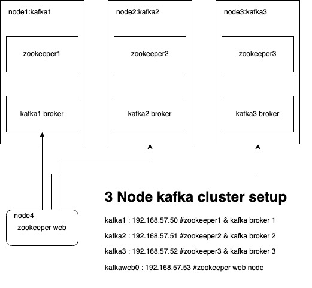

# 3 node kafka cluster installation
Ansible playbook installs 3 node kafka cluster, this is tested on ubuntu 16 LTS.

# Infra design

# Note
- Enable access to intenet on all server
- Disable firewall and selinux
- Setup ansible user as root
- zookeeper data dir /data/zookeeper
- kafka data dir /data/kafka

## Installation instructions
1.   Update hosts file and run following commands to install and configure zookeeper, try to retain the server host name.

        - ansible-playbook zookeeper-install.yml
        - ansible-playbook zookeeper-web-install.yml

2.   Run following commands to install and configure kafka
     
        - ansible-playbook kafka-install.yml
